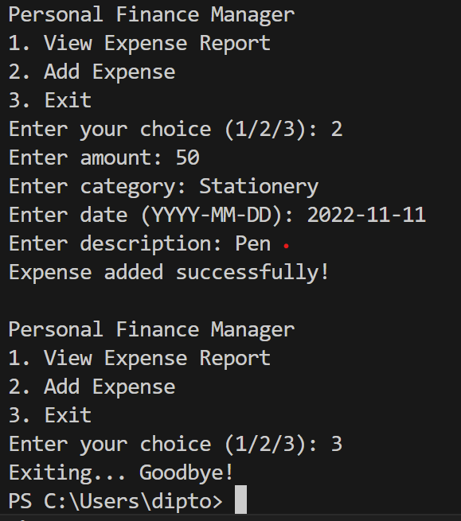
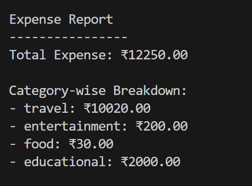

# Personal Finance Manager – Documentation

## Project Overview
The Personal Finance Manager is a command-line Python application that helps users track daily expenses. Users can add expenses and view total and category-wise summaries. The project is designed as a learning exercise to understand modular Python programming and file-based data persistence.

## Installation & Setup
1. Ensure Python 3.9 or above is installed
2. Clone the repository
3. Navigate to the project root
4. Run the application using:


## User Guide
- Choose option 1 to view expense reports
- Choose option 2 to add a new expense
- Choose option 3 to exit the application

## Code Explanation
- `main.py` :controls the program flow and menu
- `expense.py` :defines the Expense class
- `file_manager.py` :handles CSV file operations
- `reports.py` :contains logic for calculating totals and summaries
- `utils.py` :contains helper functions

# Personal Finance Manager

A Python-based command-line Personal Finance Manager that helps users track expenses, store data persistently, and generate summary reports. The project is built using object-oriented design principles and CSV-based file handling.

## Project Objectives
- Track daily expenses using a structured data model
- Store and retrieve expense data persistently
- Generate total and category-wise expense reports
- Provide a simple and user-friendly command-line interface

## Features
- Add new expenses with amount, category, date, and description
- View total expenses
- View category-wise expense breakdown
- Persistent data storage using CSV files
- Modular and maintainable code structure

## How to Run
1. Ensure Python 3.9 or higher is installed
2. Clone the repository
3. Navigate to the project root directory
4. Run the application using:
   ```bash
   python src/main.py


## Troubleshooting
- Ensure Python is correctly installed
- Run the program from the project root
- Check that `expenses.csv` exists inside the `data` folder

## Screenshots

### Application Menu


### Expense Report Output



